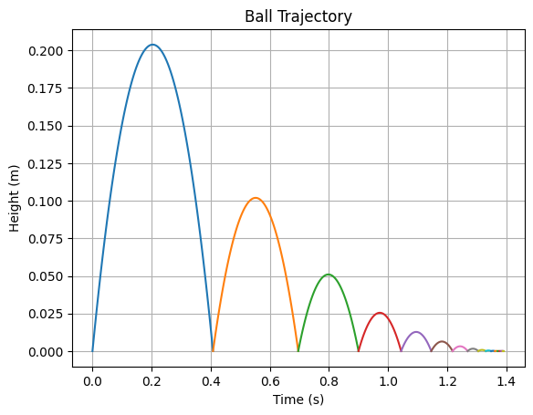

```python
%pip install sympy
```

    Requirement already satisfied: sympy in ./.venv/lib/python3.12/site-packages (1.13.3)
    Requirement already satisfied: mpmath<1.4,>=1.1.0 in ./.venv/lib/python3.12/site-packages (from sympy) (1.3.0)
    Note: you may need to restart the kernel to use updated packages.


```python
import numpy as np
import matplotlib.pyplot as plt
```


```python
constants = {
    'g': 9.81,  # m/s^2
    'm': 0.5,   # kg
    'Disipation': 0.5,  # J/m
    'Energy' : 1,
    'iter' : 1000
}
```


```python
class Ball():
    def __init__(self,  energy: float, mass: float,):
        self.energy = energy
        self.mass = mass
        self.eq = self.getEq()
        self.roots = self.getRoots()
        self.time = self.getTime()
        self.height = self.getHeight()
        self.time_shift = 0

    def getEq(self):
        second_term = np.sqrt(2 * self.energy / self.mass)
        first_term = -constants['g'] / 2
        coeff = [first_term, second_term, 0]
        return coeff
    
    def getRoots(self):
        coeff = self.eq
        roots = np.roots(coeff)
        real_roots = roots[roots.imag == 0].real
        real_roots = np.sort(real_roots)
        return real_roots
    
    def getTime(self):
        time = np.linspace(self.roots[0], self.roots[1], 100)
        return time
    
    def getHeight(self):
        coeff = self.eq

        height = np.polyval(coeff, self.time)
        return height
    
    def shiftTime(self, time_shift: float):
        self.time_shift = time_shift
        self.time = self.time + time_shift
        return self.time
    
    def updateRoots(self):
        self.roots = self.roots + self.time_shift
    
def getEnergyArr(energy: float, n: int):
    if n == 0:
        return [energy]
    else:
        return [energy] + getEnergyArr(energy * constants['Disipation'], n - 1)
    


```


```python


energys = getEnergyArr(constants['Energy'], constants['iter'])
balls = [Ball(energy, constants['m']) for energy in energys]

for i, ball in enumerate(balls):
    if i == 0:
        plt.plot(ball.time, ball.height, label=f'Energy: {ball.energy} J')
    else:
        ball.shiftTime(balls[i-1].roots[1])
        ball.updateRoots()
        plt.plot(ball.time, ball.height, label=f'Energy: {ball.energy} J')

plt.title('Ball Trajectory')
plt.xlabel('Time (s)')
plt.ylabel('Height (m)')
plt.grid()
```


    

    


```python
import random

alay_simple_dict = {
    'a': ['a', '4', '@'],
    'e': ['e', '3'],
    'i': ['i', '1', '!'],
    'o': ['o', '0'],
    'u': ['u', 'ü'],
    's': ['s', 'z', '$'],
    'g': ['g', 'q'],
    'b': ['b', '8'],
    't': ['t', '7']
}

vokal = 'aeiou'

def alay_custom(text, level):
    # Normalisasi level ke 0-10
    level = max(0, min(10, level))
    replace_chance = level / 10
    repeat_chance = level / 15  # lebih kecil supaya gak lebay banget
    caps_chance = level / 20    # random kapital kecil aja

    result = ''
    for char in text:
        new_char = char

        # Ganti karakter dengan simbol jika ada di kamus dan kena chance
        if char.lower() in alay_simple_dict and random.random() < replace_chance:
            new_char = random.choice(alay_simple_dict[char.lower()])
        
        # Kapitalisasi acak
        if new_char.isalpha() and random.random() < caps_chance:
            new_char = new_char.upper()

        result += new_char

        # Pengulangan vokal dikit (biar lucu)
        if char.lower() in vokal and random.random() < repeat_chance:
            result += char.lower() * random.randint(1, 2)

    return result

# Input dari pengguna
user_input = input("Masukkan teks: ")
try:
    level_input = int(input("Tingkat ke-alay-an (0-10): "))
except ValueError:
    level_input = 5  # default tengah-tengah

alay_output = alay_custom(user_input, level_input)
print("Hasil typing alay:", alay_output)

```

    Hasil typing alay: P@cAaar liidIA aYuu $4putRi


```python
def clean_ascii_heart(char='♥'):
    heart = [
        f"        {char*5}       {char*5}        ",
        f"     {char*11} {char*11}     ",
        f"   {char*29} ",
        f"  {char*31}",
        f" {char*32}",
        f" {char*32}",
        f"  {char*31}",
        f"   {char*29} ",
        f"     {char*23}     ",
        f"       {char*19}       ",
        f"         {char*15}         ",
        f"           {char*11}           ",
        f"             {char*7}             ",
        f"               {char*3}               ",
        f"                {char}                "
    ]
    
    for line in heart:
        print(line)

# Jalankan
clean_ascii_heart()

```

            ♥♥♥♥♥       ♥♥♥♥♥        
         ♥♥♥♥♥♥♥♥♥♥♥ ♥♥♥♥♥♥♥♥♥♥♥     
       ♥♥♥♥♥♥♥♥♥♥♥♥♥♥♥♥♥♥♥♥♥♥♥♥♥♥♥♥♥ 
      ♥♥♥♥♥♥♥♥♥♥♥♥♥♥♥♥♥♥♥♥♥♥♥♥♥♥♥♥♥♥♥
     ♥♥♥♥♥♥♥♥♥♥♥♥♥♥♥♥♥♥♥♥♥♥♥♥♥♥♥♥♥♥♥♥
     ♥♥♥♥♥♥♥♥♥♥♥♥♥♥♥♥♥♥♥♥♥♥♥♥♥♥♥♥♥♥♥♥
      ♥♥♥♥♥♥♥♥♥♥♥♥♥♥♥♥♥♥♥♥♥♥♥♥♥♥♥♥♥♥♥
       ♥♥♥♥♥♥♥♥♥♥♥♥♥♥♥♥♥♥♥♥♥♥♥♥♥♥♥♥♥ 
         ♥♥♥♥♥♥♥♥♥♥♥♥♥♥♥♥♥♥♥♥♥♥♥     
           ♥♥♥♥♥♥♥♥♥♥♥♥♥♥♥♥♥♥♥       
             ♥♥♥♥♥♥♥♥♥♥♥♥♥♥♥         
               ♥♥♥♥♥♥♥♥♥♥♥           
                 ♥♥♥♥♥♥♥             
                   ♥♥♥               
                    ♥                

